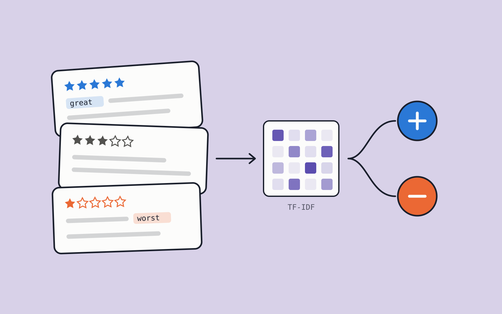
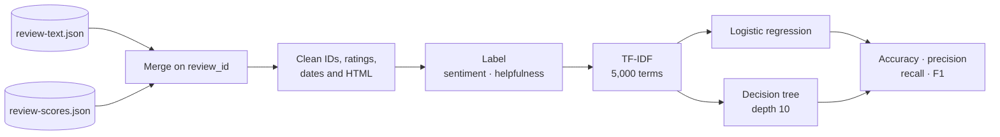
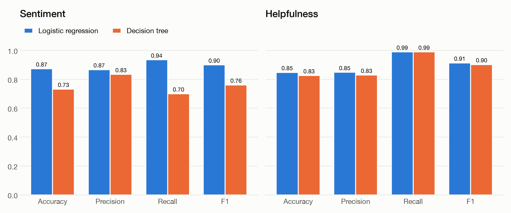
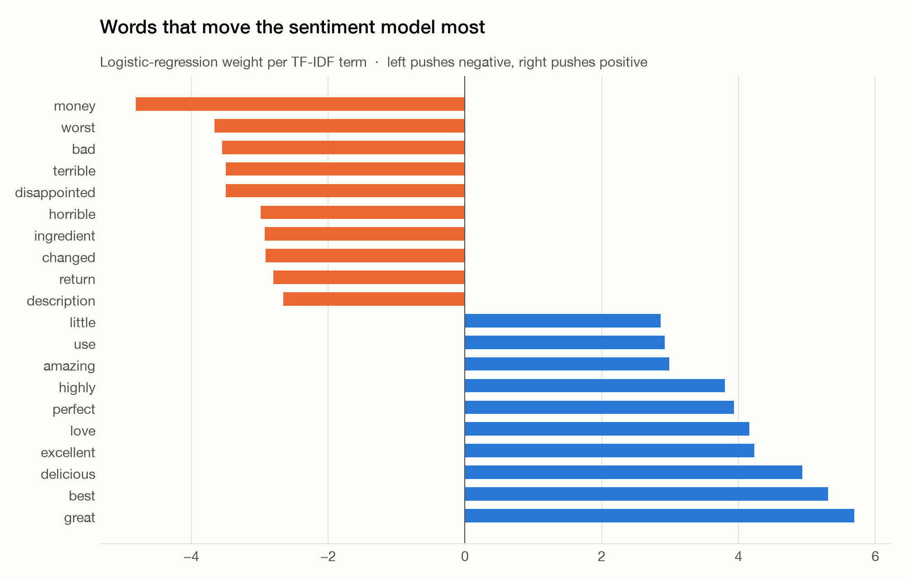
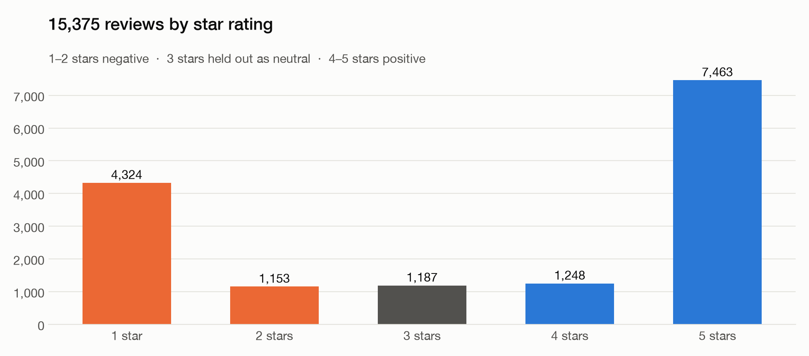
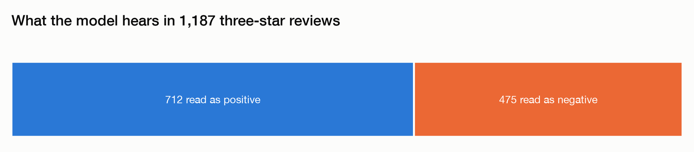

<p align="center">
  
</p>

<h1 align="center">Product Review Classification</h1>

<p align="center">
  <strong>Teach a model to read 15,375 product reviews for sentiment and helpfulness.</strong>
</p>

<p align="center">
  <a href="https://jjmensah.github.io/enam_portfolio/projects/product-review-classification/"></a>
  
  
  
  
</p>

---

Two JSON files — review text and review scores — are merged, cleaned and turned into TF-IDF
features. Logistic regression and a decision tree then learn two tasks: is a review **positive or
negative**, and will readers find it **helpful**?

## Highlights

- **Careful preparation.** Six numeric product IDs regain their `B` prefix, 24 `#oc-` user IDs are
  normalised, star strings become numbers, mixed date formats are parsed, and HTML is stripped from
  review bodies.
- **A deliberate label design.** 1–2 stars are negative, 4–5 positive, and the 1,187 three-star
  reviews are held out rather than forced into a class.
- **No leakage.** The vectoriser is fitted on training text only; both tasks use an 80/20 split.
- **Neutral reviews, re-read.** The sentiment model classifies the held-out three-star reviews:
  712 read as positive, 475 as negative.

## Pipeline



## Results

| Task | Model | Accuracy | Precision | Recall | F1 |
| --- | --- | ---: | ---: | ---: | ---: |
| Sentiment | Logistic regression | **0.874** | **0.867** | **0.935** | **0.900** |
| Sentiment | Decision tree | 0.733 | 0.834 | 0.700 | 0.761 |
| Helpfulness | Logistic regression | **0.848** | **0.849** | 0.990 | **0.914** |
| Helpfulness | Decision tree | 0.826 | 0.829 | 0.990 | 0.903 |

<p align="center"></p>

Logistic regression handles sparse, high-dimensional TF-IDF features far better for sentiment.
For helpfulness both models reach 0.99 recall; the classes are imbalanced, so they lean towards
predicting "helpful".

<p align="center"></p>

<p align="center"></p>

<p align="center"></p>

## Repository layout

```text
.
├── assets/
│   ├── cover.svg
│   └── figures/                    # generated by scripts/make_figures.py
├── data/
│   ├── raw/
│   │   ├── review-scores.json
│   │   └── review-text.json
│   └── reviews.csv                 # merged by the notebook
├── notebooks/
│   └── 01_product_review_classification.ipynb
├── reference/
│   └── brief.pdf                   # original module brief
├── scripts/
│   └── make_figures.py
└── requirements.txt
```

## Running it

```bash
python -m venv .venv && source .venv/bin/activate
pip install -r requirements.txt
jupyter notebook notebooks/01_product_review_classification.ipynb
```

To regenerate the figures (this retrains both models and prints their scores):

```bash
python scripts/make_figures.py
```
